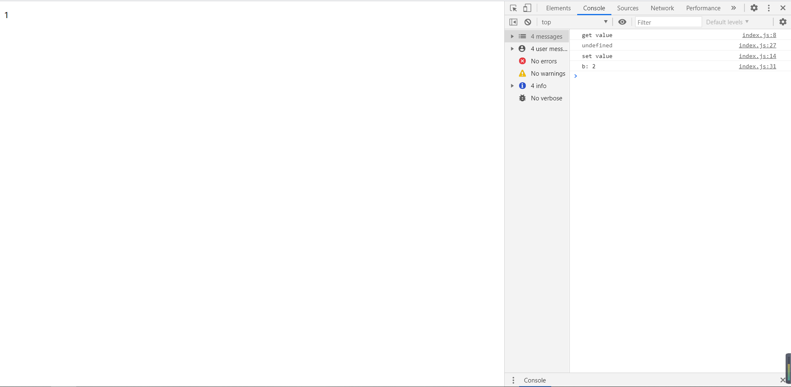
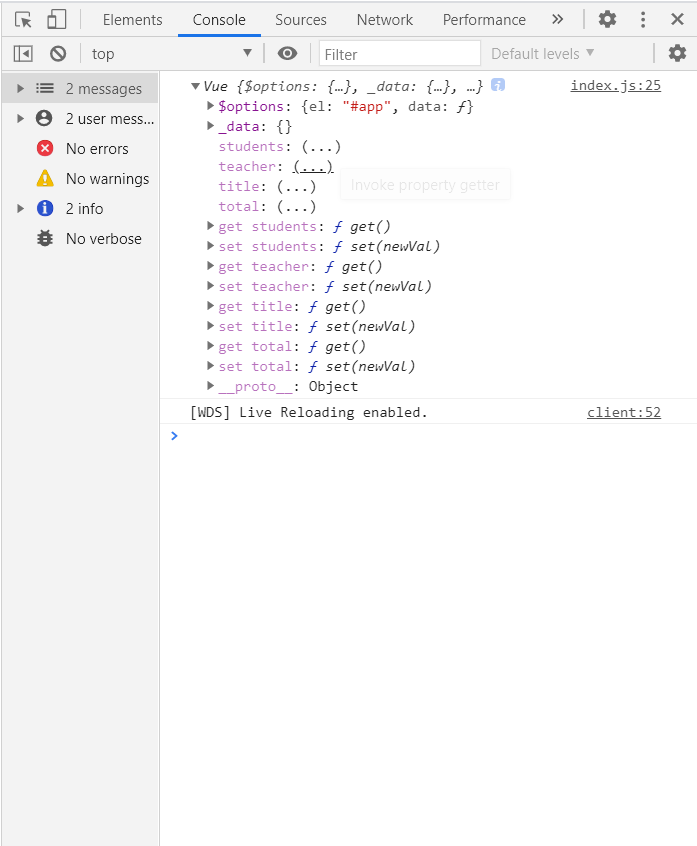
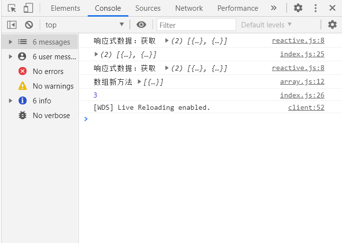
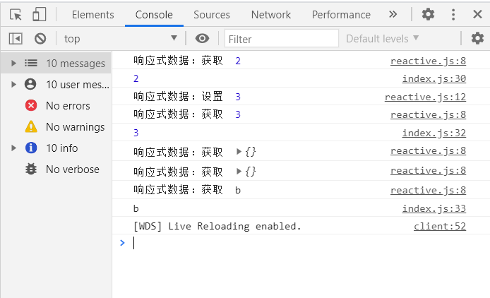

# vue_reactive
研究vue响应式原理


### Vue2.0


### 响应式原理

> 提到响应式原理，我们先来了解一下 `Object.defineProperty`  （在一个对象上定义一个新属性，或者修改一个对象的现有属性，并返回此对象）

数据劫持

```javascript
function defineProperty() {
    var _obj = {}
    var a = 0

    Object.defineProperties(_obj, {
        a: {
            get() {
                console.log('get value')
            },
            set(newVal) {
                a = newVal
                var myDom = document.querySelector("#p_dom")
                myDom.innerHTML = a
                console.log('set value')
            }
        },
        b: {
            writable: true,
            enumerable: true,
            configurable: true
        }
    })
    return _obj
}

var obj = defineProperty()
console.log(obj.a)
obj.a = 1
obj.b = 2
for(i in obj) {
    console.log(`${i}: ${obj[i]}`)
}
```

有四个配置项: **value**、**writable**、**enumerable**、 **configurable**，默认都为false

结果如下




### vue 2.0数据劫持

在vue2.0中，其实是将我们的数据进行劫持、然后挂载，再监听，首先我们创建一个vue的实例化对象

```javascript
let vm = new Vue({
    el: '#app',
    data() {
        return {
            title: '学生列表',
            total: 2,
            teacher: ['张三', '李四'],
            students: [
                {
                    id: 1,
                    name: '小明'
                },
                {
                    id: 2,
                    name: '小红'
                }
            ]
        }
    }   
})
```

这里单独拿data()来说，vue2.0的做法是返回一个函数然后进行处理，当然理论上直接返回一个对象也是可以的，但官方不推荐这么做

```javascript
let vm = new Vue({
    el: '#app',
    data: {
    	...
    	//不推荐
    }  
})
```

接着，我们需要将原来的数据中的 ‘options’挂载到vm实例上，也就是vue实例中我们所写的一些属性，data(), computed,methods...（所谓的options API）

创建一个vue初始化方法，进行数据的挂载

> 这里用到前面提到的 `Object.defineProperty()`，需要注意的是我们的数据存还可能在对象和数组，对于数组，我们需要对原生方法进行重写，实现响应式

```javascript
// vue/index.js
import { initState } from './init'
function Vue(options) {
    this._init(options)
}
Vue.prototype._init = function(options) {
    let vm = this;
    vm.$options = options
    initState(vm)
}
export default Vue;

//  vue/init.js
//再将data()的数据赋给_data再给data，这也是Vue.js的做法
function initData(vm) {
    var data = vm.$options.data;
    
    data = vm._data = typeof data === 'function' ? data.call(vm) : data || {}   //判断data()是否以函数返回,return {}
    for(var key in data) {
        proxyData(vm, '_data', key)		//对每个属性进行劫持,使得vm.xxx就可以访问到
    }
    observe(vm._data)
}

//vue/proxy.js
function proxyData(vm, target, key) {
    //数据劫持，挂载到vm上
    Object.defineProperty(vm, key, {
        get() {
            // vm.title --> vm._data.title
            return vm[target][key];
        },
        set(newVal) {
            vm[target][key] = newVal;
        }
    })
}
```

这里可以打印看到成功挂载到vm实例上



当数据类型时数组或对象时，我们需要额外的操作，所以我们需要对数据进行观察

```javascript
observe(vm._data)

function observe(data) {
    if(typeof data !== 'object' || data === null) return;
    return new Observer(data);
}
```

再判断是否为数组，分别进行响应式处理，如果是对象，需要注意的是可能存在多层嵌套，所以需要用到递归观察，在set()当中也需要对数据进行观察

```javascript
import defineReactiveData from './reactive'
function Observer(data) {
    //判断是数组还是对象
    if(Array.isArray(data)) {
        data.__proto__ = arrMethods;
        observeArr(data)
    }else {
        this.walk(data);
    }
}
Observer.prototype.walk = function(data) {
    var keys = Object.keys(data);
    for(var i = 0; i < keys.length; i++) {
        var key = keys[i],
            value = data[key]
        defineReactiveData(data, key, value)
    }
}

// vue/reactive.js
function defineReactiveData(data, key, value) {
    //递归观察
    observe(value);
    Object.defineProperty(data, key, {
        get() {
            console.log('响应式数据：获取 ', value)
            return value
        },
        set(newVal) {
            console.log('响应式数据：设置 ', newVal);
            if(value === newVal) return;
            observe(newVal)
            value = newVal;
        }
    })
}
```

测试一下效果

```javascript
 data() {
    return {
        title: '学生列表',
        total: 2,
        teacher: ['张三', '李四'],
        info: {
            a: {
                b: 'b'
            }
        },
        students: [
            {
                id: 1,
                name: '小明'
            },
            {
                id: 2,
                name: '小红'
            }
        ]
    }
}   

console.log(vm.total);
vm.total = 3;
console.log(vm.total);
console.log(vm.info.a.b);
```

可以看到，嵌套的对象也是响应式的



最后就是对数组类型的劫持，首先我们列出会改变原数组的数组方法

```javascript
var ARR_METHODS = [
    'push',
    'pop',
    'shift',
    'unshift',
    'splice',
    'sort',
    'reverse'
]
```

对原生数组方法进行重写，继续对参数进行观察

```javascript
var originArrMethods = Array.prototype,
    arrMethods = Object.create(originArrMethods)

ARR_METHODS.map(function(m) {
    arrMethods[m] = function() {
        var args = Array.prototype.slice.call(arguments),
            rt = originArrMethods[m].apply(this, args)  //方法仍用原来的
        console.log(`数组新方法`, args)
        
        var newArr;
        switch (m) {
            case 'push':
            case 'unshift':
                newArr = args
                break;
            case 'splice':
                newArr = args.slice(2)
                break;
            default:
                break;
        }
        newArr && observeArr(newArr)
        return rt;
    }
})

//  vue/observeArr.js
function observeArr(arr) {
    for (var i = 0; i < arr.length; i++) {
        observe(arr[i])
    }
}
```

再让我们测试一下

```javascript
console.log(vm.students)
console.log(vm.students.push({
    id: 3,
    name: '张三'
}))
```

可以看到数组类型也是响应式数据了




到此，简易的vue数据劫持就算完成，总的来说，vue2.0用 `Object.defineProperty` 对所有数据进行劫持再进行操作，对数组类型方法进行重写以保持响应式


+ 另外

Vue 不能检测以下数组的变动：

1. 当你利用索引直接设置一个数组项时，例如：`vm.items[indexOfItem] = newValue`
2. 当你修改数组的长度时，例如：`vm.items.length = newLength`

解决：

```js
// Vue.set
Vue.set(vm.items, indexOfItem, newValue)

// Array.prototype.splice
vm.items.splice(indexOfItem, 1, newValue)
```